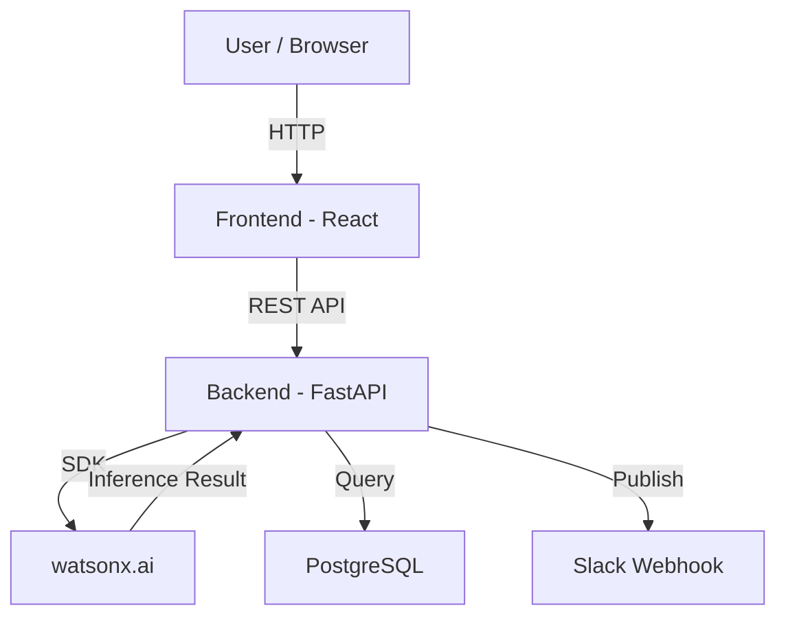

# Architecture

## System Architecture

[Describe the overall architecture of your system. Replace the Mermaid diagram below with your actual architecture.]

## Components

| Component | Technology | Responsibility |
|---|---|---|
| Frontend | [e.g., React 18] | [Water-network dashboard, sensor visualization, GIS map and operator interaction |
| Backend API | [e.g., FastAPI] | [Processes sensor data, applies detection logic and prepares results for the dashboard] |
| AI / ML | [e.g., watsonx.ai] | [Anomaly detection, contamination analysis and risk assessment] |
| Database | [e.g., PostgreSQL] | [Displays affected pipeline zones, incident locations and downstream risk areas] |
| Notifications | [e.g., Slack API] | [e.g., Alerting on threshold breaches] |

## Data Flow

1.Sensor data is collected from pressure, flow and water-quality inputs such as pH, turbidity and conductivity.
2The incoming data is processed and analyzed to identify abnormal patterns in pipeline behaviour and water quality.
3AI-based analysis evaluates the detected anomalies and identifies potential leak, pipe-burst or contamination events.
4Multiple signals are correlated to improve the understanding of the incident rather than relying on a single sensor reading.
5The affected geographic zone is identified and displayed through the GIS/map layer, including potentially at-risk downstream areas.
6AquaSentinel generates a prioritized alert containing the detected issue, location and risk information.
7IBM Bob / the operator interface presents the intelligence so the water-network team can investigate and decide on the appropriate response.

## Security Considerations

• No real credentials or API keys are stored in the source code.
• Production deployment should use secure API communication and protected environment variables.
• Role-based access should restrict sensitive network information and operator actions.
• The prototype does not directly control physical valves or infrastructure.

## Scalability Notes

AquaSentinel can be extended from simulated/prototype data to large-scale IoT sensor networks. Cloud-based processing can support continuous data ingestion and distributed AI analysis across multiple pipeline zones, while GIS and municipal-system integrations can enable deployment across larger cities.
